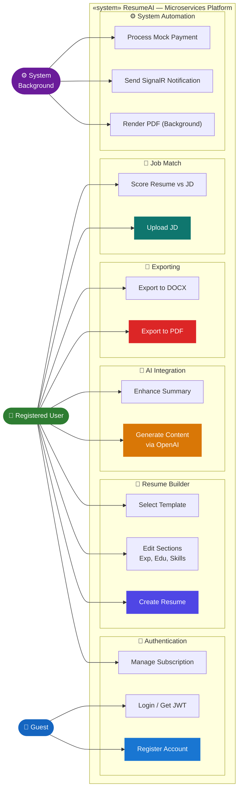
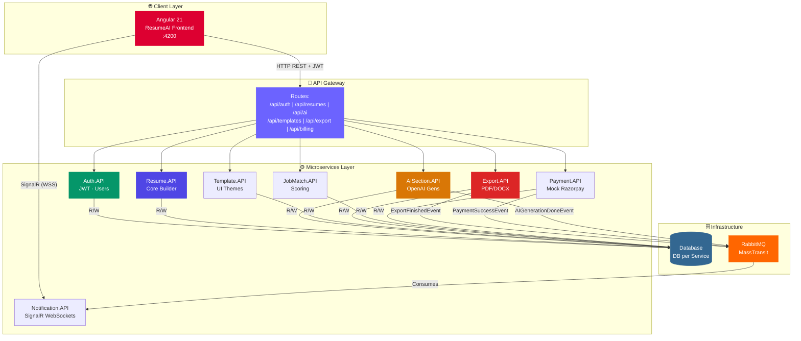
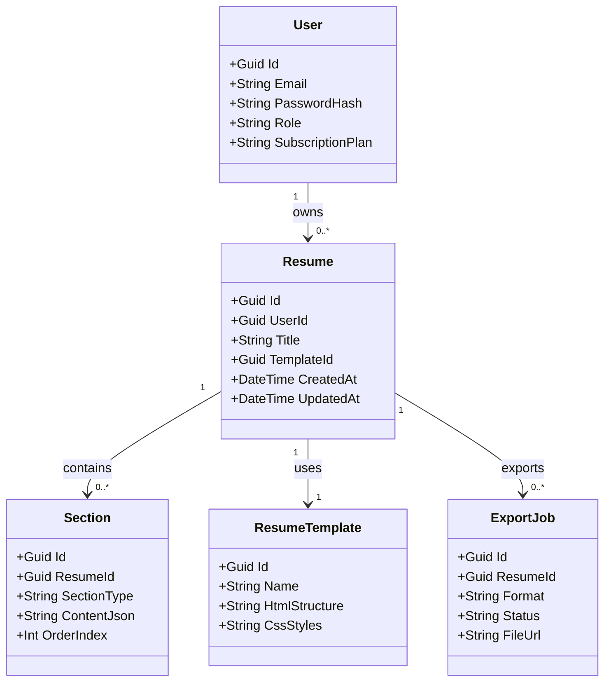
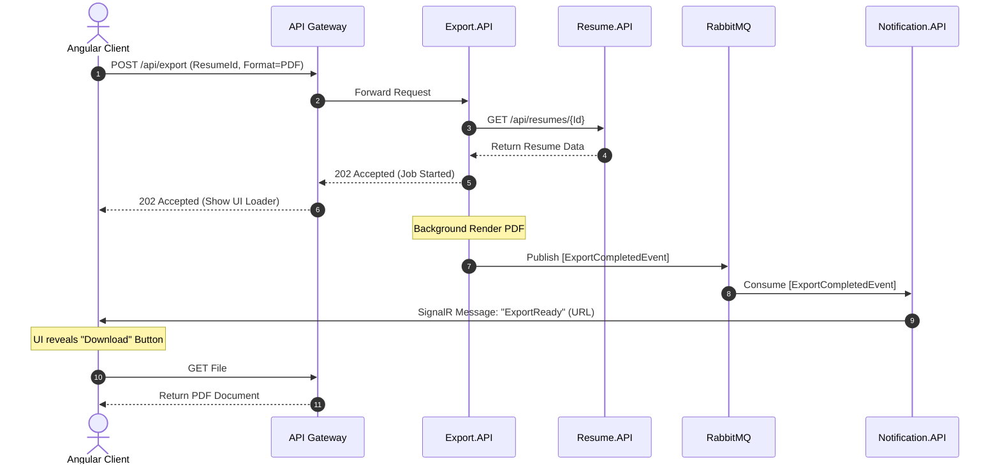
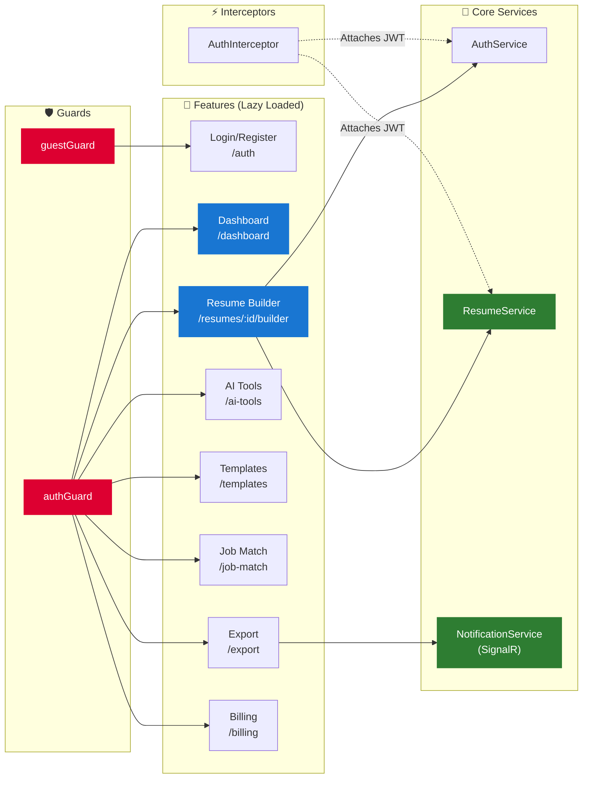
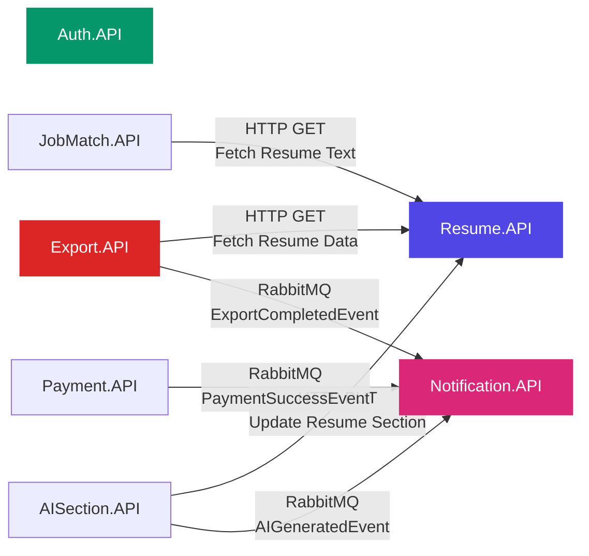

<div align="center">


# ResumeAI

### A Production-Grade AI-Powered Resume Builder Built on Microservices

[](https://dotnet.microsoft.com/)
[](https://angular.dev/)
[](https://www.microsoft.com/en-us/sql-server)
[](https://www.rabbitmq.com/)
[](https://www.docker.com/)

<p>ResumeAI is a modern, scalable resume-building platform engineered with a full microservices architecture, event-driven design patterns, and a distributed backend — enabling users to craft ATS-friendly resumes, generate content via AI, match with jobs, and export to PDF/DOCX at scale.</p>

[Architecture](#-system-architecture) · [Microservices](#-microservices-overview) · [Setup](#-getting-started)

---

</div>

## 📌 Table of Contents

- [Tech Stack](#-tech-stack)
- [Architecture Overview](#-system-architecture)
- [UML Diagrams](#-uml-diagrams)
  - [Use Case Diagram](#1-use-case-diagram)
  - [System Architecture](#2-system-architecture-diagram)
  - [Entity Class Diagram](#3-entity-class-diagram)
  - [Export Flow Sequence](#4-export-flow-sequence)
  - [Angular Component Diagram](#5-angular-frontend-component-diagram)
  - [Inter-Service Communication](#6-inter-service-communication-map)
- [Microservices Overview](#-microservices-overview)
- [Core Features](#-core-features)
- [Infrastructure](#-infrastructure)
- [Design Patterns](#-key-design-patterns)
- [Getting Started](#-getting-started)

---

## 🛠 Tech Stack

| Layer | Technology | Purpose |
|-------|------------|---------|
| **Backend** | ASP.NET Core 8 Web API | 8 independent microservices |
| **Frontend** | Angular 21 | Single-page application (Standalone Components) |
| **Database** | SQL Server / PostgreSQL | Per-service isolated databases (DB-per-service) |
| **ORM** | Entity Framework Core | Code-first migrations & data access |
| **Message Broker** | RabbitMQ + MassTransit | Async event-driven communication |
| **Real-Time** | SignalR | Websockets for instant UI notifications |
| **Auth** | JWT (HS256) | Stateless authentication |
| **Gateway** | API Gateway | Single entry point, routing & JWT validation |
| **Containerization** | Docker & Docker Compose | Full local orchestration |

---

## 🏗 System Architecture

ResumeAI follows a **Microservices Architecture** with these core principles:

| Pattern | Applied Where |
|---------|--------------|
| ✅ **Microservices** | 8 independently deployable services |
| ✅ **Event-Driven Architecture** | Async messaging via RabbitMQ + MassTransit |
| ✅ **Background Processing** | PDF/DOCX export and AI generation happen asynchronously |
| ✅ **API Gateway** | Single entry point for all Angular client requests |
| ✅ **DB-Per-Service** | Strict data isolation across all services |
| ✅ **DTO Pattern** | Separate request/response models from entities |

---

## 📐 UML Diagrams

### 1. Use Case Diagram

> All actors and use cases across every module of ResumeAI



---

### 2. System Architecture Diagram

> Full deployment view — Client → API Gateway → Microservices → Infrastructure



---

### 3. Entity Class Diagram

> Domain model for the Core Resume Service



---

### 4. Export Flow Sequence

> Sequence diagram — Event-driven, asynchronous background PDF generation



---

### 5. Angular Frontend Component Diagram

> Standalone components, lazy-loaded routes, and HTTP interceptors



---

### 6. Inter-Service Communication Map

> Synchronous calls and asynchronous events between microservices



---

## 📦 Microservices Overview

| Service | Responsibility |
|---------|----------------|
| **Auth.API** | User registration, login, JWT generation |
| **ResumeAI (Resume.API)** | Core CRUD operations for resumes and sections |
| **AISection.API** | Integration with AI to generate bullet points and summaries |
| **ExportService** | Generates PDF/DOCX files asynchronously |
| **JobMatchService** | Analyzes resume against job descriptions |
| **PaymentService** | Mock Razorpay integration for premium features |
| **NotificationService** | SignalR hub for pushing real-time alerts to the client |
| **TemplateService** | Provides HTML/CSS templates for resumes |
| **ApiGateway** | Single routing endpoint for the Angular app |

---

## 🎯 Core Features

<details>
<summary><strong>👤 User & Auth</strong></summary>

- Register and login with secure JWT (JSON Web Tokens)
- Premium subscription management mock integration

</details>

<details>
<summary><strong>📝 Resume Builder</strong></summary>

- Interactive UI to add, edit, and reorder resume sections (Experience, Education, Skills, etc.)
- Dynamic template selection to change resume aesthetics instantly

</details>

<details>
<summary><strong>🤖 AI-Powered Content</strong></summary>

- Generate professional experience bullets using AI
- Auto-write impactful professional summaries
- Eliminate manual typing with AI suggestions

</details>

<details>
<summary><strong>📄 Background Exports</strong></summary>

- Generate pixel-perfect PDFs or editable DOCX files
- Event-driven background processing to keep the UI responsive
- Real-time download links delivered via SignalR

</details>

---

## 🔧 Infrastructure

### RabbitMQ — Event Queue
- **Abstraction:** MassTransit over RabbitMQ
- **Publishers:** ExportService, PaymentService, AISection
- **Consumer:** NotificationService
- **Pattern:** Prevents long-running HTTP timeouts by offloading work to background workers.

### SignalR — WebSockets
- **Purpose:** Pushes notifications directly to the Angular client.
- **Trigger:** When a RabbitMQ event is consumed (e.g., Export Finished), SignalR broadcasts the result to the specific user's connection ID.

---

## 📊 Key Design Patterns

| Pattern | Applied Where |
|---------|--------------|
| Repository Layer | Decoupling EF Core logic across microservices |
| Dependency Injection | standard ASP.NET Core DI |
| Event-Driven Messaging | `ExportCompletedEvent` via MassTransit |
| Database-per-Service | Independent schemas for scalability |
| API Gateway | Routing frontend requests to backend services |

---

## 🚀 Getting Started

### Prerequisites

- [.NET 8 SDK](https://dotnet.microsoft.com/download)
- [Node.js 20+ & npm](https://nodejs.org/) (for Angular 21)
- [Docker Desktop](https://www.docker.com/) (for RabbitMQ and Databases)

### Running Locally

1. **Start Infrastructure**: Spin up RabbitMQ and required databases using Docker Compose.
   ```bash
   docker-compose up -d
   ```
2. **Start Backend**: Open `Sprint_Project_Resume.sln` in Visual Studio and run the multiple startup projects, or run them individually via the .NET CLI.
3. **Start Frontend**: 
   ```bash
   cd FrontEnd/resumeai-frontend
   npm install
   npm start
   ```
4. Access the application at `http://localhost:4200`.

---

<div align="center">

Made with ❤️ · ResumeAI — Microservices Platform

</div>
